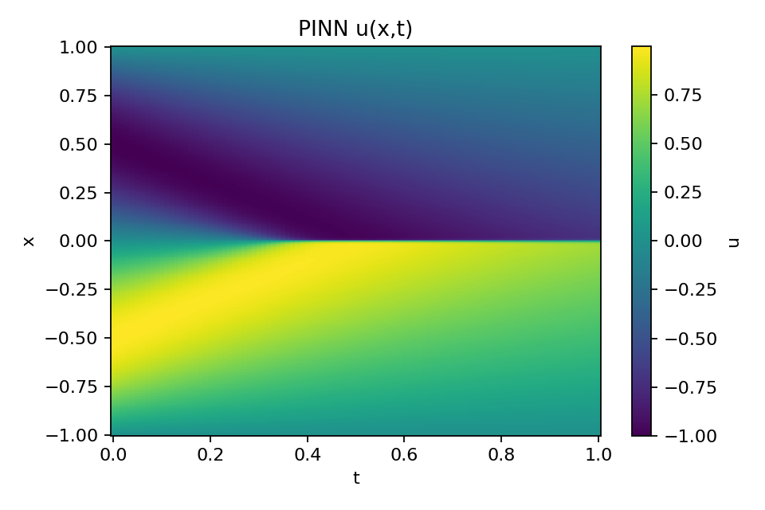
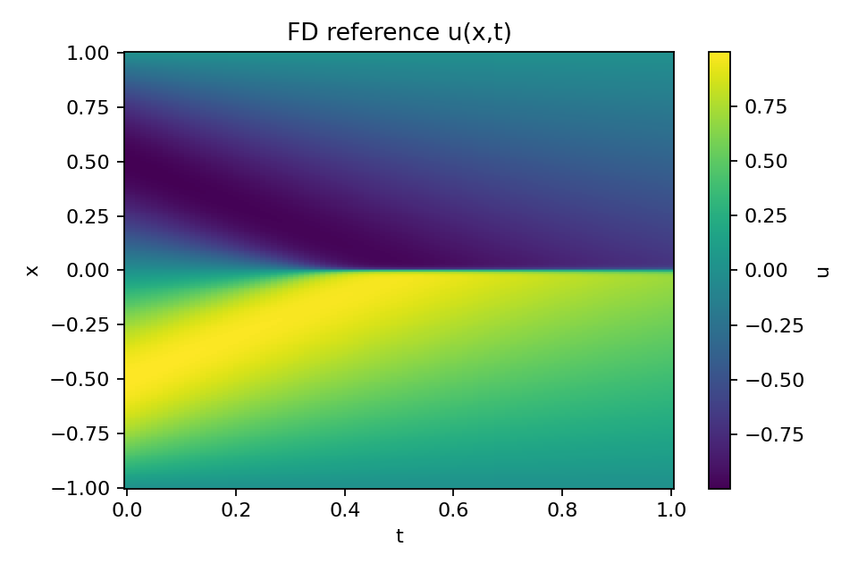
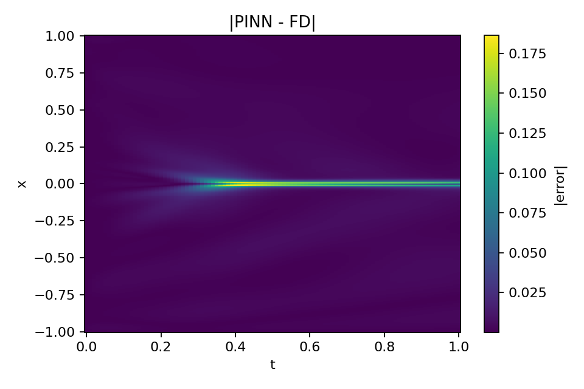
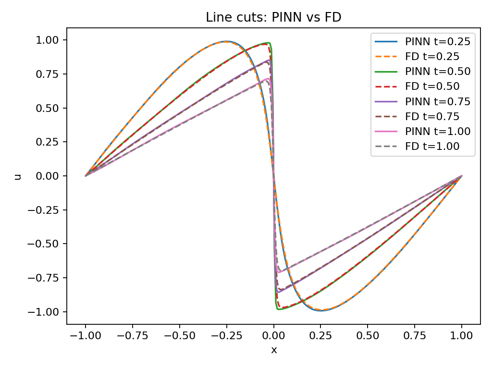

# PINN for 1D Viscous Burgers’ Equation (PyTorch)

This project implements a Physics-Informed Neural Network (PINN) to solve the **1D viscous Burgers' equation** using PyTorch.  
The solution is enforced through automatic differentiation and validated against a finite-difference (FD) benchmark solver.

---

## Problem Definition

We solve the 1D viscous Burgers' equation:

u_t + u u_x = ν u_xx  
x ∈ [-1,1],  t ∈ [0,1]  
ν = 0.01 / π  

### Initial Condition
u(x,0) = -sin(πx)

### Boundary Conditions
u(-1,t) = u(1,t) = 0

This implementation follows the continuous-time PINN formulation introduced in [1].

---

## Method Overview

The neural network approximates:

u_θ(x,t) ≈ u(x,t)

The physics residual is constructed via automatic differentiation:

r = u_t + u u_x - ν u_xx

Training minimizes a weighted combination of:

- PDE residual loss
- Initial condition loss
- Boundary condition loss

Stabilization techniques used:

- Input normalization to [-1,1]
- Batched collocation sampling
- Gradient clipping
- Two-phase loss weighting
- Adam optimizer followed by L-BFGS refinement

---

## Repository Structure

```
src/                 # PINN implementation
outputs/
  ├── figs/          # Generated figures
  └── metrics.json   # Quantitative evaluation metrics
docs/                # Project slides (PDF)
README.md
requirements.txt
.gitignore
```

---

## Results

Quantitative metrics:

- Residual mean: 9.77e-03  
- Residual median: 6.35e-03  
- Residual max: 3.67e-01  
- IC RMSE: 4.58e-04  
- BC RMSE (left): 3.26e-04  
- BC RMSE (right): 2.82e-04  
- Relative L2 error vs FD: 2.62e-02  

### Visualizations

<table>
  <tr>
    <td align="center"><b>PINN Solution</b></td>
    <td align="center"><b>FD Reference</b></td>
    <td align="center"><b>|PINN − FD| Error</b></td>
  </tr>
  <tr>
    <td align="center">
      
    </td>
    <td align="center">
      
    </td>
    <td align="center">
      
    </td>
  </tr>
</table>

<p align="center">
  <b>Line cuts comparison (PINN vs FD)</b><br>
  
</p>

<p align="center">
  <i>Additional diagnostics (residual histogram, energy decay, IC/BC checks) are available in <code>outputs/figs/</code>.</i>
</p>

---

## How to Run

### Install dependencies
```
pip install -r requirements.txt
```

### Run full pipeline (train + evaluate + benchmark + plots)
```
python src/pinn_burgers.py
```

Optional staged execution:
```
python src/pinn_burgers.py --train
python src/pinn_burgers.py --eval
python src/pinn_burgers.py --benchmark
python src/pinn_burgers.py --plots
```

Outputs are saved to:
- checkpoints/
- outputs/
- outputs/figs/

---

## Documentation & Slides

Detailed conceptual explanation is available in:

- docs/PINN_overview.pdf
- docs/PINN_basics.pdf
- docs/PINN_CFD.pdf

---

## References

[1] M. Raissi, P. Perdikaris, G.E. Karniadakis,  
*Physics Informed Deep Learning (Part I): Data-driven Solutions of Nonlinear Partial Differential Equations*,  
arXiv:1711.10561, 2017.

---

## Author

Faiq Shahbaz  
GitHub: https://github.com/FaiqShahbaz